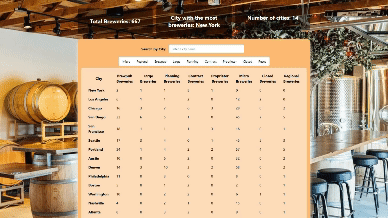

# Web Development Project 6 - Brewery Finder

Submitted by: Jason Morales

This web app: Displays Data About breweries in 14 cites

Time spent: 2 hours spent in total

## Required Features

The following **required** functionality is completed:

- [X] **The app includes at least one unique chart developed using the fetched data that tell an interesting story**
- [X] **Clicking on an item in the list view displays more details about it**
- [X] **Clicking on an item has a direct, unique link to that item's detail view page**

## Video Walkthrough

Here's a walkthrough of implemented user stories:

## License

    Copyright 2023 Jason Morales

    Licensed under the Apache License, Version 2.0 (the "License");
    you may not use this file except in compliance with the License.
    You may obtain a copy of the License at

        http://www.apache.org/licenses/LICENSE-2.0

    Unless required by applicable law or agreed to in writing, software
    distributed under the License is distributed on an "AS IS" BASIS,
    WITHOUT WARRANTIES OR CONDITIONS OF ANY KIND, either express or implied.
    See the License for the specific language governing permissions and
    limitations under the License.
